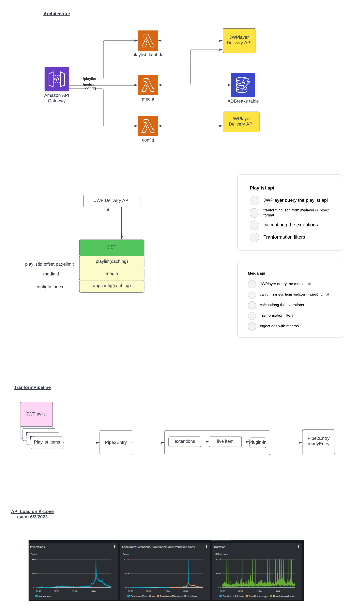

# DSP to serve feeds for applicaster

The MSM API provides the folowing APIS

1. playlist
2. Media
3. appconfig
4. Account
5. Search

# Building a deploying using cdk

The project is CDK enabled and have custom bash commands to deploy

DEV environment :

https://tbn-dsp-api-dev.tbnsandbox.com/v1/playlist/?playlistid=KlFlsAns&page_offset=1&page_limit=100
https://tbn-dsp-api-dev.tbnsandbox.com/v1/appconfig?configid=1noqgj6q&index=0&page_offset=1&page_limit=1
https://tbn-dsp-api-dev.tbnsandbox.com/v1/search?playlistid=h0lwa1JX&page_limit=50&page_offset=1&search=jesus
https://tbn-dsp-api-dev.tbnsandbox.com/v1/media?mediaid=DpkE3yXS&disablePlayNext=false

PROD environment URLS:

https://tbn-dsp-api-prod.tbncloud.com/v1/playlist?playlistid=KlFlsAns&page_limit=40&page_offset=1
https://tbn-dsp-api-prod.tbncloud.com/v1/appconfig?configid=1noqgj6q&index=0&page_offset=1&page_limit=1
https://tbn-dsp-api-prod.tbncloud.com/v1/search?playlistid=h0lwa1JX&=Episodes&page_limit=50&page_offset=1&search=jesus
https://tbn-dsp-api-prod.tbncloud.com/v1/media?mediaid=DpkE3yXS&disablePlayNext=false

## deployed commands

- `./cdk-deploy-to-dev` deploy to dev
- `./cdk-deploy-to-prod` deploy to dev

" "

# API DOCS :

https://tbntv.atlassian.net/wiki/spaces/Meritplus/pages/107675667/Production+Apps
